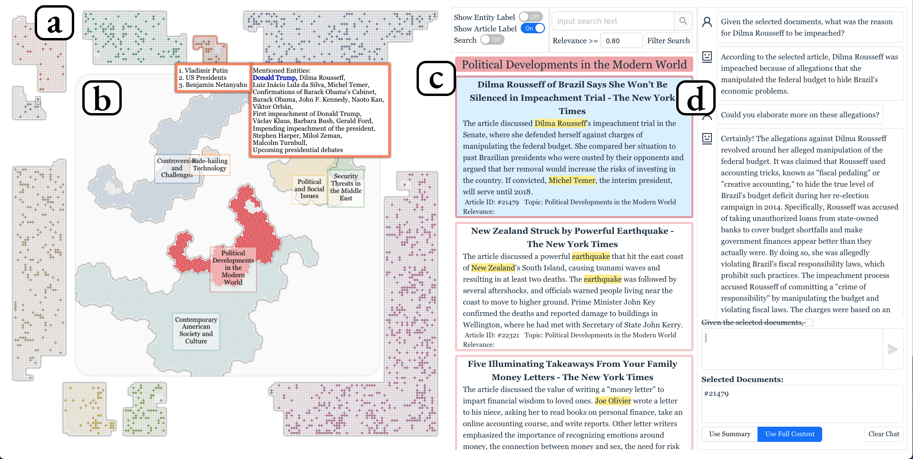

# HINTs 
This is the open source repository for paper `HINTs: Sensemaking on large collections of documents with Hypergraph visualization and INTelligent agents`: https://arxiv.org/abs/2403.02752

## Overview

Overview of the HINTs system.

(a) The peripheral area of Cluster View shows the mentioned keywords of highlighted documents using Gilbert curves. 

(b) The center area of Cluster View shows the topic structure of the corpus using Gosper curves. 

(c) The Document View shows a list of selected documents. 

(d) The Chatbot View provides a chatbot interface to answer user questions with the option to insert selected documents in the prompt.